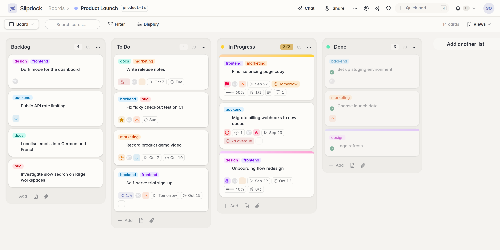
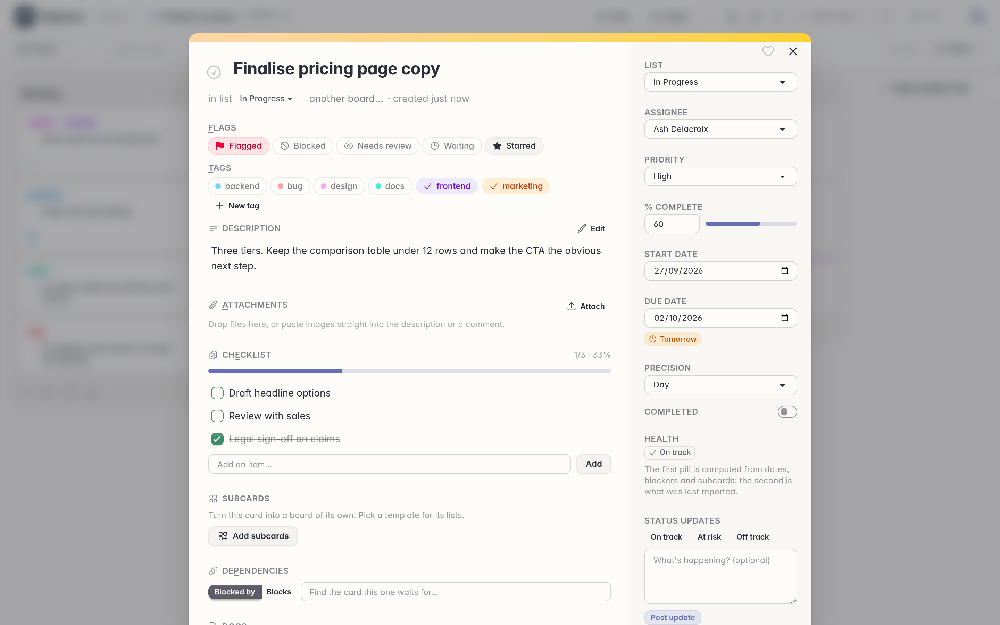
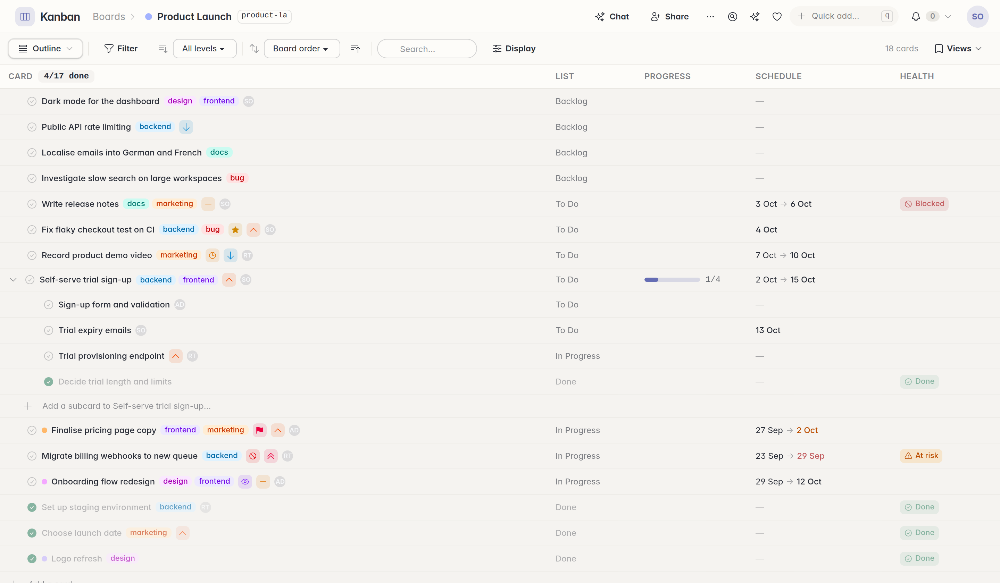
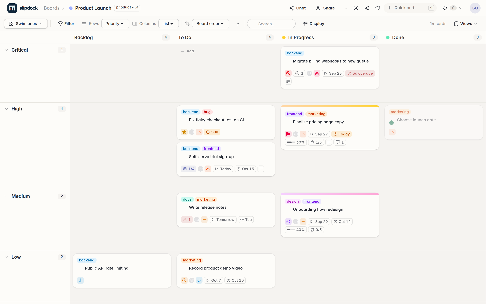
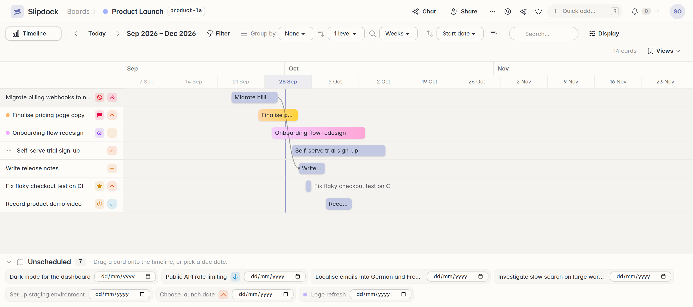
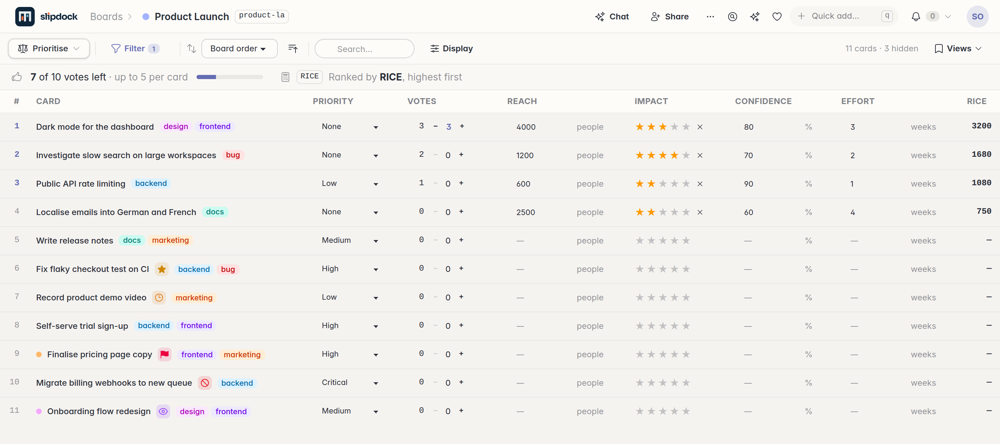
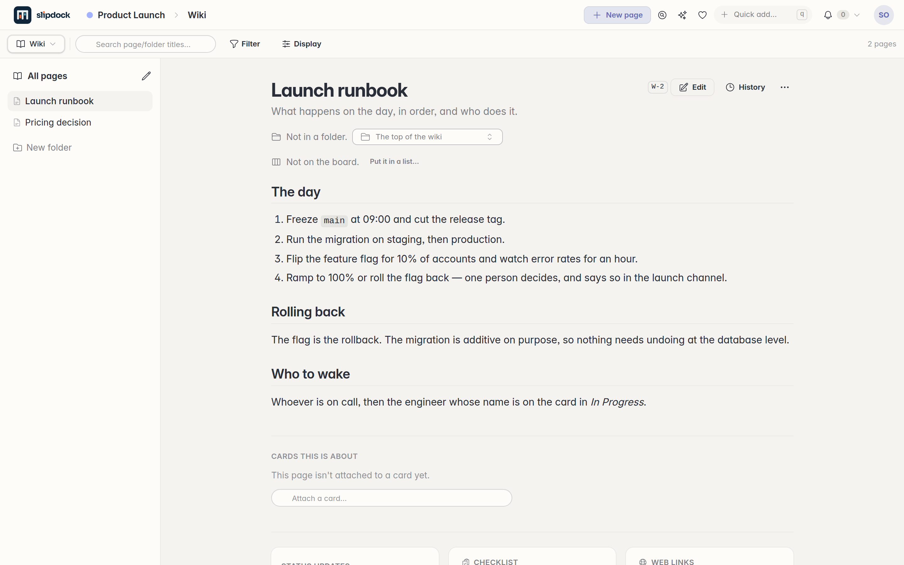
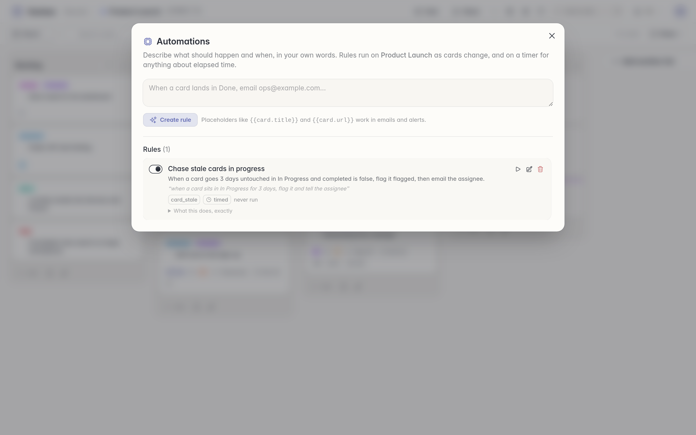
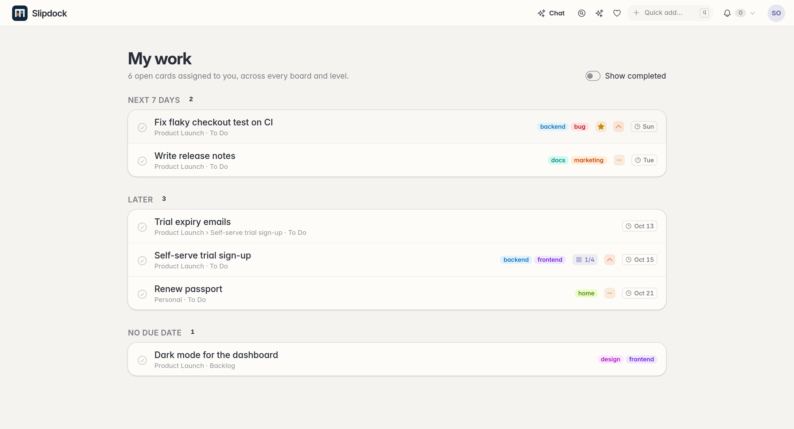

<p align="center">
  <picture>
    <source media="(prefers-color-scheme: dark)" srcset="brand/lockup-reversed.svg">
    
  </picture>
</p>

<p align="center">
  <a href="https://github.com/dadamsuk/slipdock/actions/workflows/ci.yml"></a>
  <a href="https://github.com/dadamsuk/slipdock/actions/workflows/release.yml"></a>
  <a href="https://github.com/dadamsuk/slipdock/pkgs/container/slipdock"></a>
  <a href="LICENSE"></a>
</p>

A self-hosted kanban board for people who want their work tracker to be theirs and to really help get their job done: you can easily self-host for free or use the [hosted version](https://slipdock.us). Functionality of the two is identical. It's different (better?) than most Kanban boards though, because it incorporates features built on real world experience of hundreds of projects, none of the fluff you don't need and everything that you do. This system was built for a real use case: replacing Jira Tickets, Jira Product Discovery, Jira Atlas (particularly sharing updates with stakeholders) and Confluence. And with the optional AI integrations, it's better than all of them. 



Any card can become a board of its own, so an epic and its tasks
live in one place and roll up. The same cards can be read as a board, a
swimlane grid, a table, a Gantt timeline, a calendar, an outline or a ranked
backlog. Each board carries a wiki, so the documentation/reasoning sits beside the work.
Automations are written in plain English ("flag any card which is more than 3 days overdue to urgent and send an email to john@example.com"). You can give it plain English commands too: "Split this card into 3 sub-cards", interrogate it: "Across all my boards, what tasks do I have that are slated to take less than 1 day?".  And it has semantic search: "Where's the card about the invoicing bug that came in last week" (that doesn't even mention the word invoice).  

And best of all the whole thing is available over
a JSON API and a CLI, so an agent can work the board the way a person does.  Chat with Claude or ChatGPT about your work, get it to create your cards, run loops off the back of them.  Whatever you need.

## A word on AI coding...

Of course it was built using AI. But it wasn't vibe coded in an hour. First it was born of 30+ years of experience of managing projects and writing software. Second it was planned out and carefully constructed with robust testing and verification.  And third it has been security reviewed by multiple different coding agents. 

> A plan is falsework: the structure that holds the thing up while it is being built, and comes away when it stands on its own. This is somewhere to put it.

Built with Phoenix LiveView, so every browser looking at a board updates the
moment anything changes.

## A look around

| | |
|---|---|
|  **A card** — flags, tags, checklist, dependencies, roll-up health, status updates |  **Outline** — the board as a tree, subcards and all |
|  **Swimlanes** — any attribute on either axis |  **Timeline** — Gantt bars, dependency lines, draggable |
|  **Prioritise** — RICE, ICE and votes, edited in place |  **Wiki** — Markdown pages on the board, with revisions |
|  **Automations** — a sentence becomes a rule |  **My work** — everything assigned to you, across every board |

There are more in [docs/screenshots](docs/screenshots), the phone layout
included. They are taken from a demo workspace anybody can rebuild —
`tools/screenshots.sh` makes a throwaway database, fills it with
`mix slipdock.demo`, runs a server of its own and photographs it.

## What it does

Briefly, with the detail in [the manual](docs/manual.md):

- **Boards, lists and cards** — drag and drop, priorities, five flags, due
  dates, tags, checklists, comments, attachments, cover colours, archive and
  restore. Each board has a short code (`qvm-v1-rem`) that addresses it
  everywhere.
- **Subcards** — [any card becomes a board of its own](docs/manual.md#subcards-and-templates),
  nesting as deep as the work does, and
  [rolls up](docs/manual.md#roll-ups-the-outline-and-my-work): leaves done,
  effective dates, slip, blocked-anywhere-below, health.
- **Seven views** of the same cards —
  [board](docs/manual.md#features), [swimlanes](docs/manual.md#swimlanes),
  [table](docs/manual.md#table), [timeline](docs/manual.md#timeline),
  [calendar](docs/manual.md#calendar),
  [outline](docs/manual.md#roll-ups-the-outline-and-my-work) and
  [prioritise](docs/manual.md#prioritise) — each with filters, display
  options and saved views that can be shared or published.
- **Planning** — [dependencies with cycle detection, list categories and
  horizons, milestones, custom and formula fields (RICE, ICE, value/effort),
  budget voting, typed links and goals](docs/manual.md#roadmapping).
- **A wiki per board** — [Markdown pages in a tree of folders](docs/manual.md#wiki),
  `[[links]]`, live card chips, live query blocks, backlinks, revisions,
  templates, export and public links. Plus a
  [Narrative view](docs/manual.md#narrative) that tells you what happened to a
  set of cards over a date range.
- **Automations** — ["when a card lands in Done, email ops@example.com"](docs/manual.md#automations-and-alerts),
  parsed once by a model and then run by the app, with alerts in the header
  and callbacks (GET or POST, with the card's title, link, dates, flags and
  status) out to anything else you run.
- **Semantic Search** - find what you're looking for even when you can't remember exactly what it is.
- **AI, on your own key — or your own hardware** — [chat about a board, ask
  questions in prose over every board at once, search by meaning rather than
  substring, and an edit mode you approve before it applies](docs/manual.md#ai-assistant).
  Bring an OpenRouter key, or point it at any OpenAI-compatible endpoint of
  your own — LM Studio, Ollama, llama.cpp, vLLM — and nothing leaves your
  network at all. Neither one, no AI features; nothing is sent anywhere
  without one.
- **Built for the keyboard and the phone** — [a command palette, a key for
  every board, card labels you can jump to](docs/manual.md#keyboard), and
  [a layout below 640px that is a pager rather than a sideways
  scroll](docs/manual.md#on-a-phone).
- **A tour that is made of the thing it describes** — the first time somebody
  signs in they get a **Getting Started** board:
  [a dozen cards explaining the app](docs/manual.md#getting-started), with an
  epic, subcards, a working automation and three wiki pages, so nobody meets a
  blank page and the explanation of flags is a card with flags on it. Archive
  it when you are done; `slipdock welcome` brings it back.
- **Accounts and sharing** — [passwordless sign-in, groups, and read-only or
  editable grants on a board, a single card, a wiki page or a saved
  view](docs/manual.md#accounts-and-sharing). A board somebody shared with you
  says whose it is on your board list, so a list of boards is never a list of
  boards of unknown provenance, and its *…* menu has a **Shared** page saying
  who handed it over with a **Discard** button that gives the access back —
  plus
  [a device flow for signing an agent in](docs/manual.md#signing-an-agent-in)
  from anywhere, with scoped, expiring, revocable tokens.
- **Boards that can leave** — [a whole board tree as one JSON file another
  Slipdock reads back](docs/manual.md#moving-boards-between-servers): lists,
  cards, subcards, tags, checklists, comments, custom fields, dependencies and
  the wiki. Plus the wiki on its own as a folder of Markdown, and everything
  you have as a zip. Nothing here is a one-way door.
- **A JSON API and a CLI** — [everything the UI can do](docs/manual.md#json-api),
  [from the shell](docs/manual.md#cli), plus
  [agent skills](docs/manual.md#skills) the server ships and a
  `/api/guide` that describes *your* boards to whatever is driving them.
- **An agent on your board in a minute** —
  [setting one up](docs/agents.md) needs no software and no access to the
  server: give it the address, approve it once in the browser, and it reads the
  server's own guide for the rest. The app has the same thing with your address
  filled in, under **Set up an agent**.

## Running it

### With Docker

You need **Docker** with the Compose plugin; `docker compose version` should print v2 or newer.

#### Linux

**1. Get the two files.**

```sh
mkdir slipdock && cd slipdock
curl -O https://raw.githubusercontent.com/dadamsuk/slipdock/main/compose.yaml
curl -O https://raw.githubusercontent.com/dadamsuk/slipdock/main/setup.sh
```

There is no need to clone the repository: the image is published and
`docker compose up` pulls it. (Cloning works too, and is what you want if you
mean to change something — see *Building it yourself* below.)

**2. Answer five questions.**

```sh
sh setup.sh
```

It asks the address people will use, whether something like Cloudflare or nginx
terminates TLS in front of it, which port to listen on, your email address, and
whether you have a mail server. Then it writes a `.env` you can edit by hand
afterwards if you want to change anything. 

**3. Start it.**

```sh
docker compose up -d
```

Whenever you change `.env` afterwards, run that same command again. **Not
`docker compose restart`** — that reuses the existing container and re-reads
nothing, which makes a setting look as though it did not work.

#### On Windows

**1. Get the two files.**

```powershell
curl.exe -O https://raw.githubusercontent.com/dadamsuk/slipdock/main/compose.yaml
curl.exe -O https://raw.githubusercontent.com/dadamsuk/slipdock/main/setup.ps1
```


**2. Run the setup script.**

```powershell
powershell -ExecutionPolicy Bypass -File setup.ps1
```

The `-ExecutionPolicy Bypass` is because Windows refuses
downloaded scripts by default

`setup.sh` from the Linux instructions should work if you have **WSL** or **Git Bash**.

**3. Start it.**

```powershell
docker compose up -d
```

Whenever you change `.env` afterwards, run that same command again. **Not
`docker compose restart`** — that reuses the existing container and re-reads
nothing, which makes a setting look as though it did not work.

#### Linux and Windows

**4. Set it up.** Open the address you gave it. A server
nobody has claimed shows a **setup wizard**, which asks for a token printed in
the log the first time it starts:

```sh
docker compose logs slipdock | grep -A4 "has not been set up"
```

The wizard asks three things — who may register, how mail goes out, and
your own email address.  You can change these settings later from the admin menu.

**5. Sign in.** Until a mail server is configured, your sign-in code is written
to the log rather than emailed:

```sh
docker compose logs slipdock | grep "Sign-in"
```

#### Doing it without a browser

`setup.sh` asks for your email address and writes `SLIPDOCK_ADMIN_EMAIL`, which
is what skips the wizard. By hand, these do the same:

```sh
SLIPDOCK_ADMIN_EMAIL=you@example.com     # becomes the admin; skips the wizard
SLIPDOCK_SIGNUP_MODE=closed              # open | allowlist | approval | closed
SLIPDOCK_SMTP_HOST=smtp.example.com      # and _PORT, _USER, _PASSWORD, _FROM
```

Or afterwards, from the command line:

```sh
docker compose run --rm slipdock setup --admin you@example.com
docker compose run --rm slipdock setup --status
docker compose run --rm slipdock setup --sign-in-link you@example.com
docker compose run --rm slipdock setup --make-admin you@example.com
```

Use the sign-in-link option if emailing a link isn't working.  

#### Behind a TLS proxy

The container speaks plain HTTP on port 4000 and assumes something in front of
it terminates TLS.

```sh
SLIPDOCK_URL_SCHEME=https
SLIPDOCK_URL_PORT=443
SLIPDOCK_PUBLISH=127.0.0.1:4000   # only the proxy needs to reach it
```

If people reach the server by more than one name, list the others in
`SLIPDOCK_CHECK_ORIGIN` — live updates are refused for names you did not
mention, which looks like a page that loads but never changes.

To make the app force HTTPS itself, build it with
`--build-arg SLIPDOCK_FORCE_SSL=true`.

#### Which build is running

**Configuration** shows, at the top of the page, when the running build was
compiled and the commit it came from — the first thing worth checking when a
server is not behaving the way the code in front of you says it should.
`slipdock admin build` prints the same line from a terminal.

There is no `.git` inside the image, so a Docker build has to be told the
commit:

```sh
docker build --build-arg SLIPDOCK_GIT_SHA=$(git rev-parse HEAD) .
```

Without it the commit reads `unknown`, which is the honest answer rather than
a wrong one.

#### Upgrading

```sh
docker compose pull
docker compose up -d
```

Migrations run themselves on boot. Read [UPGRADING.md](UPGRADING.md) first — it
says what changed and what, if anything, you have to do.

`latest` follows the main branch. To pin a version instead, set `SLIPDOCK_TAG`
in your `.env` to any published tag.

#### Backing up

There are two volumes. `slipdock-db` is the Postgres database; `slipdock-data`
holds uploaded files, each person's AI key and endpoint, and a
`SECRET_KEY_BASE` the container generates for itself on first run. **Those
volumes are the only copy**, and backing them up is the one piece of
maintenance this app asks of you.

The database is backed up with `pg_dump` rather than by copying its files,
because a dump is consistent and restorable into any later Postgres:

```sh
docker compose exec -T postgres pg_dump -U slipdock -Fc slipdock > slipdock-db.dump
docker compose stop
docker run --rm -v slipdock_slipdock-data:/data -v "$PWD":/backup alpine \
  tar czf /backup/slipdock-backup.tar.gz -C /data .
docker compose start
```

The volume is named after the compose project, which `compose.yaml` pins to
`slipdock` — so it is `slipdock_slipdock-data` wherever you put the directory.
Check with `docker volume ls` if in doubt; backing up a volume name that does
not exist produces a cheerful, empty archive.

To restore, stop the app, then untar into the same volume with
`tar xzf /backup/slipdock-backup.tar.gz -C /data`.

#### Administrative tasks

A release has no `mix`, so the ones worth having are on the entrypoint:

```sh
docker compose run --rm slipdock setup --status   # what this server allows
docker compose run --rm slipdock ai-key           # who has an AI key
docker compose run --rm slipdock reindex          # rebuild the search index
docker compose run --rm slipdock welcome you@example.com   # the Getting Started tour board
docker compose run --rm slipdock migrate          # migrations, by hand
docker compose run --rm slipdock remote           # an IEx shell in the running app
```

#### Building it yourself

The image is built for `amd64` and `arm64`. For anything else, or to run your
own changes:

```sh
git clone https://github.com/dadamsuk/slipdock.git
cd slipdock
docker compose build
docker compose up -d
```

The first build takes a few minutes — it compiles the app and its assets — and
later ones reuse most of that. Set `SLIPDOCK_PULL_POLICY=missing` in `.env` so
that `up` stops reaching for the published image.

#### If something is wrong

| What you see | What it usually is |
|---|---|
| `/setup` gives a 404 | The server is already set up. `setup --status` says by whom; `setup --sign-in-link` gets you in. |
| "not allowed to sign up here" for your own address | That address has no account and registration is closed. `setup --make-admin you@example.com` makes one, makes it an admin, and prints a way in. |
| Every page redirects to `/setup` | The opposite: it has never been claimed. Finish the wizard. |
| The wizard will not take the token | It is in the log from the **first** boot: `docker compose logs slipdock \| grep -A4 "has not been set up"`. |
| No sign-in email arrives | Expected until SMTP is configured — the code goes to the log. Set it under **Configuration → Email**, which will not save until a test message actually arrives. |
| The page loads but never updates | `PHX_HOST` is not the name you are reaching it by. The log says so, in a box, naming the value to set. |
| Sign-in links point at `localhost` | Same cause, same fix. |
| Links say `:4000` when you are behind Cloudflare or nginx | `SLIPDOCK_URL_SCHEME` and `SLIPDOCK_URL_PORT` describe how people reach it, not how the container listens — so `https` and `443`. `setup.sh` asks this. |
| Refused from `app.example.com` while `PHX_HOST` is `example.com` | They are different hostnames. Use the one in the address bar, or list the rest in `SLIPDOCK_CHECK_ORIGIN`. |
| You set `PHX_HOST` and nothing changed | Either `docker compose restart` (which re-reads nothing — use `up -d`), or a shell variable that was never exported. `echo $PHX_HOST` lies about that; `env \| grep PHX_HOST` does not. The container prints what it actually got: `docker compose logs slipdock \| grep entrypoint:`. |
| Reached by more than one name | Keep the main one in `PHX_HOST`, list the rest in `SLIPDOCK_CHECK_ORIGIN=a.example,b.example`. |

### Running it for other people

Slipdock is built for one person or a team who trust each other, and it will
also run as a small shared service. A handful of things make that difference,
all under **Configuration → Server**, with the people themselves under
**Users**:

- **Who may register** — closed, an allowlist, approval one at a time, or open.
- **An item limit for free accounts**, counted against the boards somebody
  *owns*, so a guest working on your board costs them nothing. An item is a
  card, a wiki page or an uploaded file — all three count, or writing the work
  up as pages would be a way round it.
- **A free trial**: free accounts stop being able to add anything so many days
  after they were made. Off by default. It is independent of the item limit —
  an account can have no item limit at all and still run out of trial, or have
  both and hit whichever comes first. Nothing is deleted and nobody is locked
  out: an expired account reads and edits everything it has.
- **Who has paid**, per person under **Users**: a paid-up date takes somebody
  off the free allowance and off the trial clock. There is no billing in
  Slipdock; whoever takes the money sets the date.
- **Who people can see** — everyone on the server, or only the people they
  actually share a board, card or page with. The second is what stops two
  customers of one server learning that the other exists; it also keeps their
  addresses out of the prompts sent to a language model.
- **Whether sharing with a stranger makes them an account**, which is how
  somebody arrives on a hosted instance and is usually wrong on a private one.

#### The ceilings, which are not about selling anything

Separately from all of that, **every install has three ceilings on, however it
is run** — a server you host for yourself included:

| Ceiling | Default | Counts |
| --- | --- | --- |
| Boards one person may own | 1,000 | Root boards. Sub-boards, the ones behind subcards, do not count. |
| Items on one person's boards | 250,000 | Cards, wiki pages and uploaded files together. |
| Files on one person's boards | 10 GB | The size of every attachment behind them. |

They are a safety rail rather than a price list: a runaway script or an import
gone wrong should hit something. **Admins are not exempt** — an admin who means
to go past one raises it, which takes a moment and leaves a record of the
decision. Each has its own switch, so any of them can be turned off without
losing the number behind it, and where a free account's own allowance is lower
than the ceiling, the lower one wins.

### Settings: the environment seeds them once

Everything about *how this server behaves* — who may register, the free
allowance and the trial, the ceilings, who shows up in people pickers, whether sharing something with a
stranger makes them an account, and how mail is sent — lives in the database
now, so it can be changed from a browser without a redeploy.

The environment still configures it, but only as a **seed**: the variables
below are written into the settings the first time the server starts, and are
ignored from then on.

```sh
SLIPDOCK_ADMIN_EMAIL=you@example.com   # setting this skips the setup wizard entirely
SLIPDOCK_SIGNUP_MODE=allowlist         # open | allowlist | approval | closed
SLIPDOCK_SIGNUP_ALLOW=you@example.com,example.org   # seeds the allowlist
SLIPDOCK_FREE_CARD_LIMIT=20            # items allowed on one free account's own boards
SLIPDOCK_TRIAL_DAYS=30                 # free accounts stop adding after this long (unset = no trial)
SLIPDOCK_BOARD_LIMIT=1000              # boards one person may own; 0 or "off" for no ceiling
SLIPDOCK_ITEM_LIMIT=250000             # cards, pages and files together; 0 or "off" for none
SLIPDOCK_STORAGE_LIMIT_MB=10240        # uploaded files, in MB; 0 or "off" for no ceiling
SLIPDOCK_USER_DIRECTORY=shared_only    # instance | shared_only
SLIPDOCK_INVITES_CREATE_ACCOUNTS=false # whether sharing with a stranger makes an account
SLIPDOCK_SMTP_HOST=smtp.example.com    # and SLIPDOCK_SMTP_PORT / _USER / _PASSWORD / _FROM
SLIPDOCK_LOGIN_FALLBACK=false          # never write sign-in codes to a file (set this when public)
```

There is a command-line equivalent for an install that was not configured that
way, and a `--status` that says what the server currently thinks:

```sh
mix slipdock.setup --admin you@example.com --mode allowlist --allow example.com
mix slipdock.setup --status
mix slipdock.setup --sign-in-link you@example.com   # when mail has broken
mix slipdock.setup --make-admin you@example.com     # a server with no usable admin
```

It refuses to run on a server that is already set up — that server is already
somebody's.

**Changing one of these on a server that has already started does nothing.**
That is deliberate — a browser has to be able to win, or the settings page
would be a lie — but it does mean a variable edited after the fact looks
ignored, because it is. Change it in the app instead.

Two exceptions, which are overrides rather than seeds and win every time:
`SLIPDOCK_LOGIN_FALLBACK=false`, so a public host can forbid writing sign-in
codes to a file whatever the settings say, and `SLIPDOCK_AGENTIC_LOGIN`.

### From a checkout

You need Elixir 1.19 or newer on Erlang/OTP 27 and a Postgres to point it at;
the asset tools install themselves. There is a compose file for the database if
you would rather not install one:

```sh
git clone https://github.com/dadamsuk/slipdock.git
cd slipdock
docker compose -f compose.dev.yaml up -d   # Postgres on 127.0.0.1:5434
mix setup          # deps, database, seeds, assets
mix phx.server     # the address it binds to is printed on start-up
```

`mix setup` seeds a demo workspace on an empty database, which is the same one
the screenshots come from (`mix slipdock.demo` builds it on demand). In
development the server binds to this machine's Tailscale address if it has one,
otherwise loopback; `SLIPDOCK_BIND_IP` and `PORT` override that, and
`DATABASE_URL` points it at another database.
[`deploy/slipdock.service`](deploy/slipdock.service) is a systemd unit template for
running it on boot — see [the manual](docs/manual.md#as-a-service).

## Security notes

This is a self-hosted app that holds everything you are working on, and some of
these are decisions only you can make.

- **Sign-up is closed by default.** A server nobody has set up yet lets the
  first address in, which is how an instance gets claimed; after that
  registration follows whichever mode you chose — *closed* (accounts exist only
  because you made them), *allowlist* (named addresses and whole domains),
  *approval* (people ask, you say yes) or *open* (anybody), which is sensible
  only when the server is already behind a boundary of your own. The mode and
  the allowlist are editable in the app; `SLIPDOCK_SIGNUP_MODE` and
  `SLIPDOCK_SIGNUP_ALLOW` seed them on first boot.
- **Sign-in is passwordless and rate limited** — a one-time link valid for 15
  minutes, a session that lasts 30 days, five attempts an hour per address and
  twenty per IP, so nobody can use your server to mail strangers. A refused
  address is told exactly what an accepted one is told.
- **Responses carry a Content-Security-Policy** that allows script from this
  origin only.
- **Administering the server needs its own token scope.** The admin pages
  (**Configuration** for registration and mail, **Users** for the people and the
  signup queue) are behind an admin account, and
  over HTTP it also needs a token deliberately made with the `admin` scope. API
  tokens live in agents and CI; an ordinary read/write one leaking should not be
  a key to who may register.
- **Agents get scoped tokens, not your account.** `slipdock auth` shows a code,
  you approve it in a browser you are already signed into, and the agent is
  given a token you can see and revoke. A token can be read-only, confined to
  named boards, and made to expire; Account › API tokens shows when each was last
  used and from where. A read-only token is refused anything that would change
  something, and a board-scoped one cannot even list boards outside its scope.
- **Agentic Login is an authentication bypass, by design**, and is *not* how to
  sign an agent in — the device flow above is. With
  `SLIPDOCK_AGENTIC_LOGIN=true` the sign-in page will write a working link for
  *any* address to a file on the server, so a test running on that server can
  sign itself in. It is off unless you set it, and a server with it on says so
  in the log on every boot. Only ever enable it on a machine used for testing.
- **AI runs on each person's own key or endpoint**, kept in a `0600` JSON file
  outside the database. Somebody with neither gets no AI features at all, and
  no board content leaves the server on their behalf. Back that file up like a
  `.env`, because it holds secrets in the clear. Point it at a model server on
  your own network and board content never leaves the network either.
- **Attachments are served with permission checks**, but they are whatever
  people upload: the app does not scan them.
- **Put TLS in front of it.** The Docker image does not force HTTPS, on the
  assumption that something in front terminates it; build with
  `--build-arg SLIPDOCK_FORCE_SSL=true` if the app itself should.
- **Back up the database** — the `slipdock-db` and `slipdock-data` volumes
  under Docker, or a `pg_dump` plus uploads and `ai_keys.json` from a
  checkout. There is no other copy.

To report a vulnerability, see [SECURITY.md](SECURITY.md); it also says what is
in scope and what is a deployment choice rather than a bug.

## Licence

Free software under the [GNU Affero General Public License v3](LICENSE).
Copyright © 2026 David Adams.

The AGPL's point, and the reason it was chosen here: if you run a modified copy
as a network service, the people using it are entitled to your changes. The
Account page links to the source for exactly that reason — point
`SLIPDOCK_SOURCE_URL` at your own repository if you run a fork.

## Everything else

- **[docs/manual.md](docs/manual.md)** — the full reference: every view, the
  wiki, automations, the keyboard, the JSON API, the CLI and the agent skills.
- **[docs/agents.md](docs/agents.md)** — pointing Claude, ChatGPT or anything
  else at your boards: the address, the approval, the skills, and what to do
  when it will not connect.
- **[UPGRADING.md](UPGRADING.md)** — moving an existing install across the
  Kanban → Slipdock rename.
- **[CONTRIBUTING.md](CONTRIBUTING.md)** — how to work on it.
- **[SECURITY.md](SECURITY.md)** — reporting a vulnerability.
- **[AGENTS.md](AGENTS.md)** — the house rules an agent working in this
  codebase should read first.
